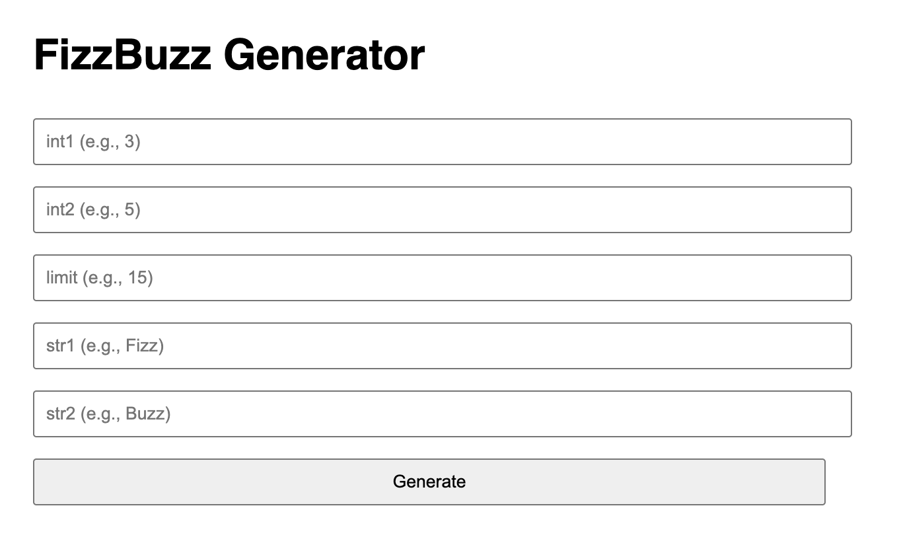

# FizzBuzz API

A simple REST API implementing the classic FizzBuzz problem with request statistics and minimal front-end.

## Live demo

API: http://fizzbuzz.chene.dev (or [here](https://fizzbuzzhdutbw4w-fizzbuzz.functions.fnc.fr-par.scw.cloud/))

More details in the [Live API](#live-api) section

## What is Fizzbuzz ? 

FizzBuzz is a classic programming exercise where numbers from 1 to 100 are printed with the following rules:
- Multiples of **3** are replaced with **"Fizz"**
- Multiples of **5** are replaced with **"Buzz"**
- Multiples of both with **"FizzBuzz"**

Example output:

```
1,2,fizz,4,buzz,fizz,7,8,fizz,buzz,11,fizz,13,14,fizzbuzz,...
```

# API Endpoints

## POST /fizzbuzz

Generate a FizzBuzz sequence, which returns a list of strings containing numbers from 1 to the specified **limit**:
- Multiples of **int1** are replaced with **str1**
- Multiples of **int2** are replaced with  **str2**
- Multiples of both with **str1str2**

Request
```
{
  "int1": 3,
  "int2": 5,
  "limit": 15,
  "str1": "Fizz",
  "str2": "Buzz"
}
```
Response
```
{
  "result": [
    "1",
    "2",
    "Fizz",
    "4",
    "Buzz",
    "Fizz",
    "7",
    "8",
    "Fizz",
    "Buzz",
    "11",
    "Fizz",
    "13",
    "14",
    "FizzBuzz"
  ]
}
```

## GET /stats

Returns the most frequently requested parameters.

Example:
```
{
  "params": {
    "int1": 3,
    "int2": 5,
    "limit": 100,
    "str1": "fizz",
    "str2": "buzz"
  },
  "hits": 42
}
```

## Live API

The service is deployed using Scaleway Serverless Containers.

It can be accessed here: http://fizzbuzz.chene.dev (or [here](https://fizzbuzzhdutbw4w-fizzbuzz.functions.fnc.fr-par.scw.cloud/))

## Minimal Front-end

A simple web interface is included to test the API directly.



## Run locally

```
make run
```

Server runs at: http://localhost:8080

Example request using curl:

```
curl -X POST http://localhost:8080/fizzbuzz \
-d '{"int1": 3,"int2": 5,"limit": 15,"str1": "Fizz","str2": "Buzz"}' \
-H 'Content-Type: application/json'
```

## Configuration

The server port can be configured using the `PORT` environment variable.

Example:

```
> PORT=8081 make run
go run ./cmd/server
2026/03/06 16:20:13 Server running on :8081
```

If not specified, the server defaults to port `8080`.

### Run tests

```
make test
```

## Project structure

```
cmd/server        → application entrypoint
configs           → configuration  
internal/fizzbuzz → core business logic
internal/handlers → HTTP handlers
internal/static   → Minimal front-end
internal/stats    → request statistics
```

## Design choices

- The HTTP layer is separated from the business logic to keep the core logic testable.
- Statistics are stored in memory and protected by a `sync.Mutex` to ensure thread safety.
- Request validation is performed before execution to ensure consistent API behavior.

## Features

- Generate FizzBuzz sequences
- Track most frequent requests
- Thread-safe in-memory stats
- JSON REST API
- Unit tests
- Minimal front-end 
- Lightweight logging and configuration
- Error handling

## Limitations

- Statistics are stored in memory and are reset when the service restarts.
- No persistent storage is used.
- The service is intentionally minimal for demonstration purposes.

## To be even more ready for production:

- Add request timeout
- Add graceful shutdown
- Add monitoring: health, metrics and improved logs
- Use Redis or another database instead of an in-memory counter for `/stats`, so it's not lost at restart
